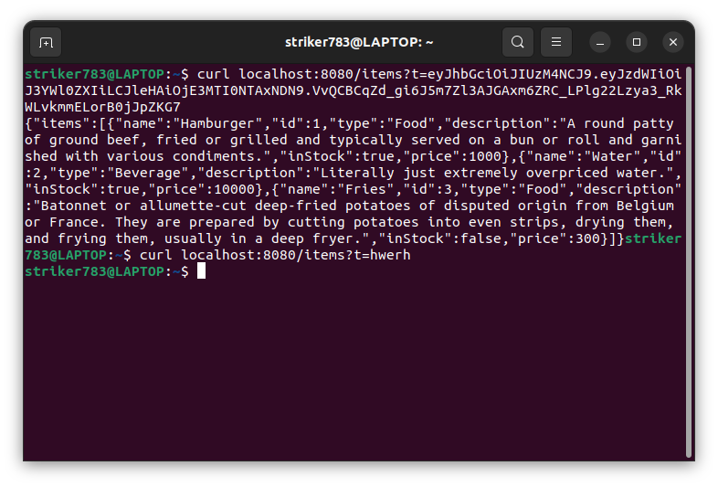

# Restaurant Ordering System Design Specification

## Functional

1. The waiters view of the table will feauture the name, table number, time of order, list of items on the menu. After selection of the orders for the table, the total price, tax and the list of items will be listed in the waiters tab. As soon as the order is taken, the list will be displayed on the cooks side.
   

(This is what the MENU looks like)

2. The waiters table view will display the tables that the waiter has been assigned to by the manager. In the section of the tables, the list of items orders by each table will be displayed and the statues of each item will be displayed. The name of the waiter will be displayed on the top of this section of the waiters tab.
3. In the cooks tab, there would be an overview section that displays the different orders that have been taken down by the waiter. The orders would be arranged in a list of time priority. The cooks tab will be go into one of the tables and select the status of each item ordered by the table. The status of each table will diplay done as soon as all items on the table are selected as ready.
4. The managers tab will have different sections that can be selected by the manager.

   1. In the section of menu, there will be a display of product just as the same way it shown on the menu. There will be an edit section on the page. If the button is clicked, there will be buttons that allow the manager to both add, click or edit items in the menu.
   2. In the staff section, there will be a button that displays all the workers, the login time, and total work hours.
   3. In the section of staff, there will be buttons representing the staff that will give the manager informations like login time, work hours, tables that workers are assigned to and the status of each table. There will also be a button that allows the manager to delete the account of the staff.
   4. Another section of the staff section, there will be a button that displays the orders. In this section, the tab will display the list of waiters as button and upon clicking the bottons, there will be a list of tables represented as buttons. Clicking each of the tables, will automatically assign the selected tables to the staff initially clicked on.
   5. Another section of the staff section will display the create account tab. In this tab, there are questions prompting the manager for the new staffs information in order to create an account.
      

5. In the table section, the tables will be displayed and the status of each table will also be displayed.

## Database

Tools: [Oracle XE](https://www.oracle.com/database/technologies/appdev/xe.html)

1. The database will use a relational database model
2. The database will use Oracle XE.
3. The logical database schema shall be as follows:
   1. There will be four tables for cooks, waiters, tables
      1. Cooks will be related to waiters
      2. Waiters will be related to the cooks and tables tables
      3. tables will be related to waiters
   2. Cooks, waiters, and tables will all have unique keys which will also be used as foreign keys
   3. Orders will be a field in the tables' table
   4. Logical Constraints must be placed such that unique IDs exist for all table entries
      1. Further constraints will be placed om the waiter and cook tables such that valid entries require first names, last names, and contact information
4. The database views will be as follows:
   1. The manager will have access to all tables
   2. Waiters will have access to a limited form of the tables table in regards to orders
   3. Cooks will have access to the waiters table data on orders assosciated with the waiters
   4. Hosts/Hostesses will have access to a limited form of the tables table in regards to table occupancy
5. The database can communicate in real time with the servers as the Oracle XE Database can allow the Java based server to communicate with the database via JDBC
6. The database will have documentation on the following:
   1. How to perform queries, item addition and deletion, and data insertion
   2. How to perform the initial data setup
   3. The configuration file
   4. How to set up the seperate views for roles
   5. All documentation will be found under the [Database](https://github.com/CEG4110-Team-Jacob/Project/wiki/Database) section of the Github Wiki

## Server

Framework: [Java Spring](https://spring.io/)

Tools: [Gradle](https://gradle.org/), [Java 21](https://www.oracle.com/java/technologies/javase/jdk21-archive-downloads.html)

1. The server will be tested via the test package within Spring.
   1. The integration testing will be within its own separate package that tests many different practical API combinations. `e. located` [here](../server/src/test/java/com/restaurantsystem/api/integrations/)
   2. The unit testing will be within a package called test. The unit tests for each file will be in a file in test with a similar path. `e. located` [here](../server/src/test/java/com/restaurantsystem/api/)
2. The server will be configurable via a file called application.properties in the standard Gradle application. `e. Example exists` [here](../server/src/main/resources/application.example.properties)
3. The only initial dependencies needed are Java 21 and a database MySQL is used. The rest of the dependencies can be installed via Gradle automatically. Gradle can also build and run the server with one command. `e. less than five initial dependencies`
4. The frontend will send the login information to the server via a POST request.

   1. The server will confirm the login information by accessing the database and checking if the username and password hash is correct. If it is incorrect, return an invalid credentials error.
   2. If it is correct, return a token that will allow the user to access information via GET requests.

   `e. Demonstration` 
   

5. The web plugin for Spring has the ability to open up APIs.

   1. When an API is accessed, the server will check if the token is valid, and the token can access the API.
   2. The server will consistently send back JSON formatted data.

   `e. Demonstration` 

6. The server will allow for real time updating via polling (constantly sending GET Requests). `e. It exists`
7. The server will connect to the database via the Spring plugin JPA. `e. it exists` [here](../server/src/main/java/com/restaurantsystem/api/data/)
   1. To allow for the switching of databases, the logic for the specific database will be separate from the server logic. `e. It is through interfaces for queries` [queries](../server/src/main/java/com/restaurantsystem/api/repos/)
8. The server will have documentation via Github Wiki on this Github repository under the section [Server](https://github.com/CEG4110-Team-Jacob/Project/wiki/Server). `e. It exists`

## User Interface!

1. The program will have a button located at the top right of the screen labeled "Exit".
   1. Clicking this button will close out of the program.
2. Managerial staff will be able to see information that other users cannot see.
   1. Managerial staff will be able to see which waitstaff is assigned to which table.
      1. This will be done by selecting either the table the manager wants to know more information about or by selecting the waitstaff they want to know more about.
   2. Managerial staff will be able to select tables and assign waitstaff to groups of tables.
      1. This will be done by selecting multiple tables and choosing which waitstaff the manager wants assigned to those tables.
3. Managerial staff will be able to edit the layout of the restaurant.
   1. This will be done by selecting a button labeled "Edit" while looking at the restaurant's layout.
      1. Selecting this button will allow management to add, remove, and move around tables at will.
4. Managerial staff will be able to edit the contents of the menu.
   1. This will be done by selecting a button labeled "Edit" while looking at the restaurant's menu.
      1. Selecting this button will allow management to add, remove, and otherwise edit menu items.
5. The program will have a button labeled "Swap Account" at the rop right of the screen, next to the button labeled "Exit".
   1. When this button is selected the current user is logged out and the user is prompted with a username and password field.
   2. Depending on the type of account, different information/permissions will be available.
6. The program will have various tabs that change the view from one thing to another, these tabs will be available on different account types.
   1. Management will have access to every tab, and all of the information associated with each tab.
   2. The program will check the permissions of the user before displaying any information as to not give the wrong staff member too much or too little information.
7. The user interface will have documentation via Github Wiki on this Github repository under the section [User Interface](https://github.com/CEG4110-Team-Jacob/Project/wiki/User-Interface).
8. The user interface will be programmed using [Java Swing](https://docs.oracle.com/javase/tutorial/uiswing/)
