# Minimum Viable Product Showcase

## Server

1. Tests: found [here](../server/src/test/java/).
   

2. An example Configuration can be found [here](../server/src/main/resources/application.example.properties)

3. The minimum dependencies are Java 21, and MySQL (Database).

4. Login with username and password.
   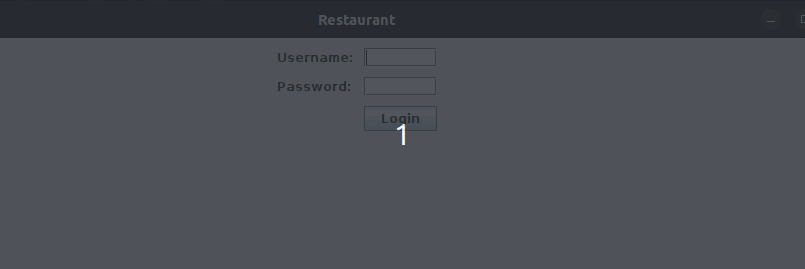
   Curl
   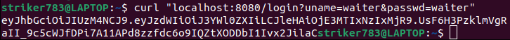

5. APIs can be found [here](../server/src/main/java/)

6. Real time updating (Polling)
   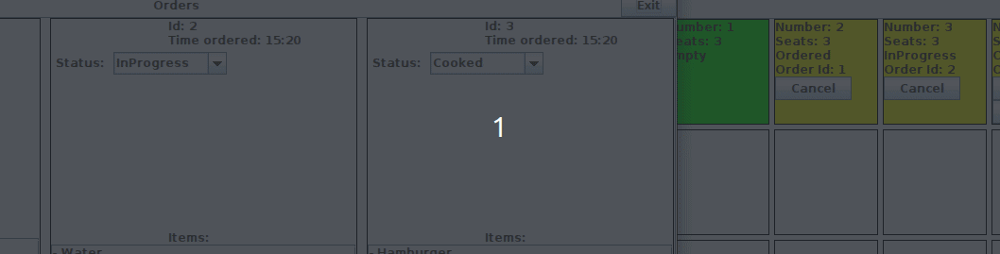

7. The database is connected via ConnectorJ.
   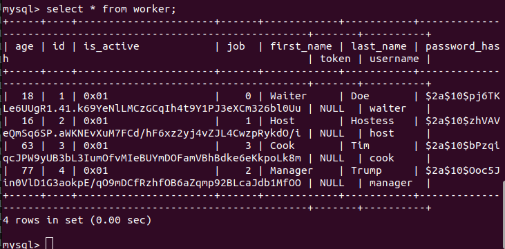

8. Documentation can be found [here](https://github.com/CEG4110-Team-Jacob/Project/wiki/Server)

## Function Requirements

1. The software allows the users to manage orders. 

2. The software allows the manager to manage the staff accounts. 

4. The software allows for management of the menu. 

## Database Requirements
1. Database ERR Diagram can be found [here](https://github.com/CEG4110-Team-Jacob/Project/blob/main/server/database/RestoDiagram.pdf)
2. Database and Views Implementation can be found [here](https://github.com/CEG4110-Team-Jacob/Project/blob/main/server/database/RestoDatabase.sql)
3. Database Documentation is pending due to issues with creating the database.

## UI Requirements
1. The button exists. 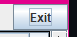
2. The manager's view of the tables. 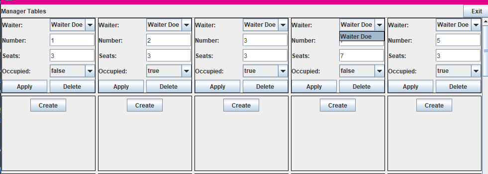
      1. The manager can assign waitstaff to tables.
      2. The manager can see which waitstaff belongs to which table.
3. The manager can add and delete tables as necessary. 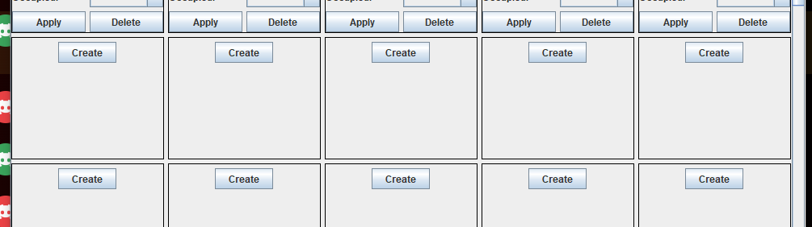
4. The manager can edit the menu as they wish. 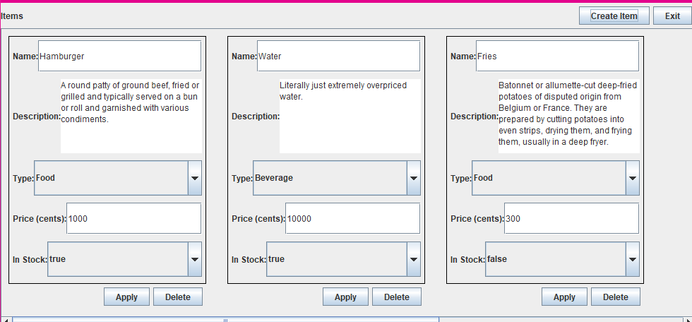
      1. The manager can add or delete items.
      2. The manager can edit the price of the items.
5. The user can use the logout button 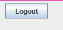 to be redirected to the login page to change accounts. 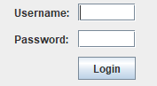
      1. The pages viewable by a user is dependent on their role
           1. Waiter: 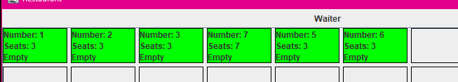
           2. Host: 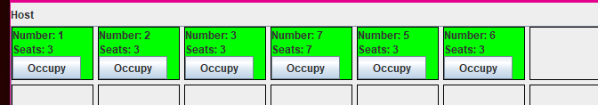
           3. Cook: 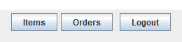
           4. Manager: 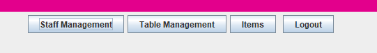
      2. The manager has access to all the pages except for the cooks "orders" page.
            1. The manager can view information on other staff members. 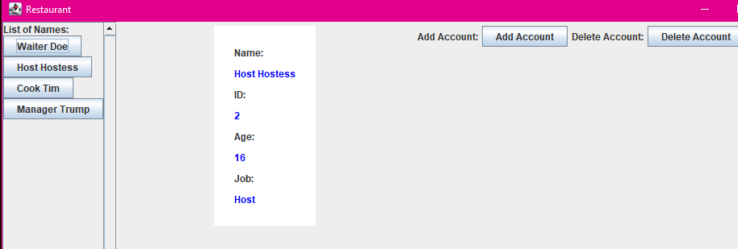
6. The manager can swap views at any time by clicking the exit button and then a different page to view.
8. Documentation has not been written at this time.
